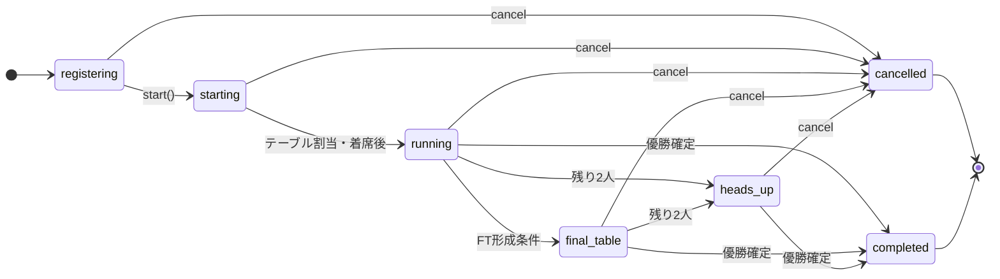
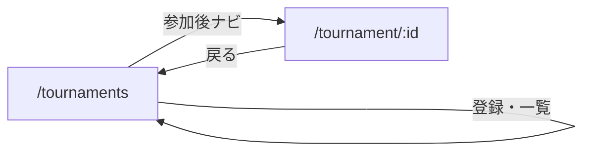

# トーナメント（MTT）機能

実装に基づく挙動・フロー・API の参照用ドキュメント。設計の意図や歴史的なメモは [mtt-design.md](./mtt-design.md) を参照。

## 概要

マルチテーブルトーナメント（MTT）では、サーバー上の `TournamentInstance` が複数の `TableInstance` を束ね、登録・ブラインド上昇・テーブルバランス・排除・ファイナルテーブル・優勝確定までを管理する。

キャッシュゲーム（マッチメイキング）との違いの要点:

- バイインがトーナメント設定の固定額で、賞金プールに積み上がる。
- ブラインドは `BlindScheduler` により時間経過で全テーブル一括更新される。
- チップが尽きたプレイヤーは排除され、順位と賞金が確定する。
- 複数テーブル間で人数が偏ったとき `TableBalancer` により移動が発生する（キャッシュの FastFold とは別の仕組み）。

## トーナメントステータス

共有型は `@plo/shared` の `TournamentStatus`（[packages/shared/src/tournament.ts](../packages/shared/src/tournament.ts)）。

補足:

- `start()` は `registering` のときのみ成功。最低人数 `minPlayers` 未満では開始できない。
- 管理 API の `cancel` は実装上、進行フェーズを問わず `cancelled` にできる（上図のとおり複数状態から遷移可能）。
- `final_table`: `formFinalTable()` で複数テーブルを1つにまとめたフェーズ。
- `heads_up`: 残り2人になった時点で設定。複数テーブルがある場合はファイナルテーブル形成がスケジュールされる。
- `completeTournament()` で `completed`。`cancel()` で `cancelled`（バイイン返却は REST 側のトランザクションで処理）。

## ユーザー向けフロー（クライアント）

ルーティングは [src/main.tsx](../src/main.tsx)（カスタム `pushState`）:

- **一覧**: `TournamentLobby` で `tournament:list` または REST `GET /api/tournaments` でアクティブなトーナメントを表示。
- **登録**: `tournament:register`。バイインは Prisma の `bankroll` から控除され、`tournamentRegistration` が作成される（[server/src/modules/tournament/socket.ts](../server/src/modules/tournament/socket.ts) の `withDbAndMemory`）。
- **登録解除**: `tournament:unregister`（**開始前**の `registering` のみ）。
- **遅刻登録**: 開催後も `isLateRegistrationOpen()` が真なら `lateRegister` が走り、テーブル着席まで行われる。
- **リエントリー**: `tournament:reenter`（設定で許可されている場合）。DB の `reentryCount` が増える。
- **画面復帰**: `tournament:request_state` でソケット差し替え・ルーム再参加・`tournament:state` と必要なら `game:state` の再送（[socket.ts の `tournament:request_state`](../server/src/modules/tournament/socket.ts)）。

ゲーム中のアクションはキャッシュと同じ **`game:action`**（`TableInstance` 共有）。状態フックは [src/hooks/useTournamentState.ts](../src/hooks/useTournamentState.ts)。

## サーバー内部フロー（開発者向け）

### モジュール

| モジュール | 役割 |
|-----------|------|
| [TournamentManager](../server/src/modules/tournament/TournamentManager.ts) | 全インスタンスのレジストリ、`playerTournaments`、完了時の DB 永続化 |
| [TournamentInstance](../server/src/modules/tournament/TournamentInstance.ts) | 1 トーナメントのライフサイクル、テーブル群、排除・FT・完了 |
| [TableBalancer](../server/src/modules/tournament/TableBalancer.ts) | 初期席割り、バランス移動・ブレイクの指示 |
| [BlindScheduler](../server/src/modules/tournament/BlindScheduler.ts) | レベル経過と次レベル時刻 |
| [PrizeCalculator](../server/src/modules/tournament/PrizeCalculator.ts) | 賞金構造の計算 |
| [socket.ts](../server/src/modules/tournament/socket.ts) | 上記以外のトーナメント用 Socket ハンドラ |

### 開始時

1. `TournamentInstance.start()` が `PrizeCalculator` で賞金テーブルを計算。
2. `TableBalancer.initialAssignment` でプレイヤーをテーブルに分割。
3. 各テーブルを `createTournamentTable()` で生成し着席、`BlindScheduler.start()`。
4. `status` を `running` にし、各テーブルで `triggerMaybeStartHand()`。

### ハンド進行中〜終了後

- `TableInstance` のトーナメント用コールバックでバスト・ハンド完了を `TournamentInstance` に伝える。
- 排除時は `tournament:eliminated`（個人） / `tournament:player_eliminated`（全体）などを送信。
- 残存人数に応じて `handlePhaseTransition` → ファイナルテーブル形成（`scheduleFormFinalTable` / `formFinalTable`）、または `TableBalancer.checkBalance` による移動。ハンド中は移動を `pendingMoves` に溜め、落ち着いてから実行。
- 移動時は `tournament:table_move` → 着席後 `tournament:table_assigned`。

### 完了時

- `completeTournament()` で `blindScheduler.stop()`、結果配列を構築し `tournament:completed` をブロードキャスト。
- `TournamentManager` の `onTournamentComplete` から `persistTournamentResults` が非同期実行され、賞金の `bankroll` 加算・`TournamentResult` 保存・`Tournament` ステータス `COMPLETED` 更新。

### 切断

- トーナメント用の切断猶予は [constants.ts](../server/src/modules/tournament/constants.ts) の `TOURNAMENT_DISCONNECT_GRACE_MS`（**2分**）。キャッシュの 30 秒猶予とは別定数。

## WebSocket イベント

型の正は [packages/shared/src/protocol.ts](../packages/shared/src/protocol.ts)。ゲーム本体のイベント（`game:*` 等）は同ファイルの `ClientToServerEvents` / `ServerToClientEvents` 全体を参照。

### Client → Server（トーナメント関連）

| イベント | ペイロード | 説明 |
|----------|------------|------|
| `tournament:list` | なし | アクティブ一覧要求 |
| `tournament:register` | `{ tournamentId }` | 参加登録（バイイン控除） |
| `tournament:unregister` | `{ tournamentId }` | 登録解除（開始前のみ） |
| `tournament:reenter` | `{ tournamentId }` | リエントリー |
| `tournament:request_state` | `{ tournamentId }` | 再接続・画面遷移後の状態再取得 |

### Server → Client（トーナメント関連）

| イベント | ペイロード | 説明 |
|----------|------------|------|
| `tournament:list` | `{ tournaments }` | 一覧応答 |
| `tournament:registered` | `{ tournamentId }` | 登録成功 |
| `tournament:unregistered` | `{ tournamentId }` | 解除成功 |
| `tournament:state` | `ClientTournamentState` | 状態更新 |
| `tournament:table_assigned` | `{ tableId, tournamentId }` | テーブル確定 |
| `tournament:table_move` | `{ fromTableId, toTableId, reason }` | 移動開始 |
| `tournament:blind_change` | `{ level, nextLevel, nextLevelAt }` | ブラインド上昇 |
| `tournament:player_eliminated` | `TournamentPlayerEliminatedData` | 排除（全体） |
| `tournament:eliminated` | `TournamentEliminationInfo` | 排除（当該プレイヤー） |
| `tournament:final_table` | `{ tableId }` | ファイナルテーブル |
| `tournament:completed` | `TournamentCompletedData` | 終了・順位 |
| `tournament:error` | `{ message }` | エラー |
| `tournament:cancelled` | `{ tournamentId }` | キャンセル |

プレイ中のベット等は **`game:action`** を使用（トーナメント専用のアクションイベントはない）。

## REST API

[server/src/modules/tournament/routes.ts](../server/src/modules/tournament/routes.ts)

管理者向け `POST` は `preHandler: requireAdmin`。`ADMIN_SECRET` が環境変数に**ある**場合はクエリ `?secret=` が一致しなければ 403。**未設定**のときは認証をスキップする（開発向け）。

| メソッド | パス | 認証 | 用途 |
|----------|------|------|------|
| GET | `/api/tournaments` | 公開 | メモリ上のアクティブ一覧（完了・キャンセル除く） |
| GET | `/api/tournaments/:id` | 公開 | `getClientState`（存在時） |
| POST | `/api/tournaments` | 管理者 | 作成 + Prisma `tournament` 行の保存 |
| POST | `/api/tournaments/:id/start` | 管理者 | `start()` + DB を `RUNNING` 等に更新 |
| POST | `/api/tournaments/:id/cancel` | 管理者 | キャンセル + 登録者へのバイイン返金トランザクション |

## データモデル

Prisma: [server/prisma/schema.prisma](../server/prisma/schema.prisma) の `Tournament`, `TournamentRegistration`, `TournamentResult`。

- **DB**: 設定・登録・結果・ステータス履歴。バイイン・賞金は `bankroll` / `transaction` と連動。
- **メモリ**: 進行中の `TournamentPlayer`（ソケット、席、チップ、排除順位など）。**サーバー再起動で進行中トーナメントのメモリ状態は復元されない**（DB に `RUNNING` が残っていても、プロセス内の `TournamentInstance` は再構築されない）。運用上はシングルプロセス継続を前提とするか、将来の永続化・復帰が必要。

## 検証・テスト

- ボット: [server/src/bot/tournamentBot.ts](../server/src/bot/tournamentBot.ts), [TournamentBotManager](../server/src/bot/TournamentBotManager.ts)
- 単体テスト: [server/src/modules/tournament/__tests__/](../server/src/modules/tournament/__tests__/)
